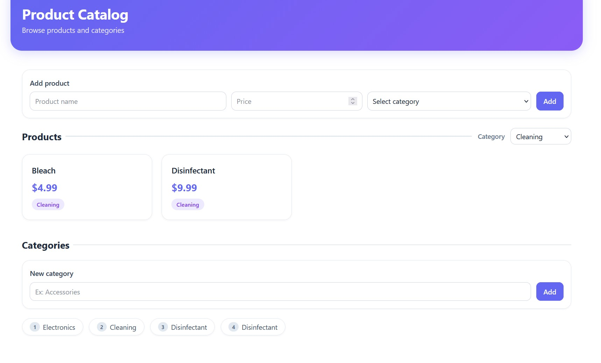
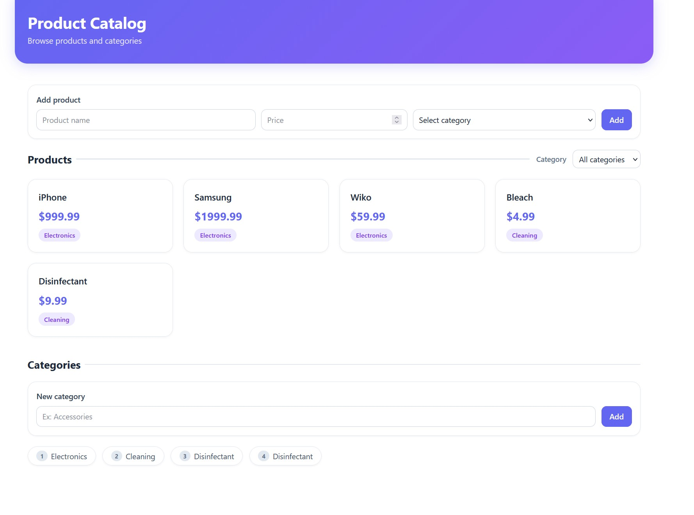

# ProductCategory

Application full-stack simple pour gerer des categories et des produits.

## Architecture (bref)
- `back/` : API REST Spring Boot (Java 21, JPA).
- `front/product-category-frontend/` : interface React + Vite + TypeScript.
- Base de donnees : PostgreSQL (configuree dans `back/src/main/resources/application.properties`).

Flux global : Frontend (`http://localhost:5173`) -> API Backend (`http://localhost:8080/api`) -> PostgreSQL.

## Prerequis
- Java 21
- Node.js 20+ et npm
- PostgreSQL (base `product_category`)

## Setup rapide
1. Creer la base PostgreSQL :
```sql
CREATE DATABASE product_category;
```
2. Verifier les identifiants DB dans `back/src/main/resources/application.properties` :
- `spring.datasource.username=postgres`
- `spring.datasource.password=admin123` (dans mon cas)

## Lancer le projet
1. Backend (dans `back/`) :
le lancer d'idea
2. Frontend (dans `front/product-category-frontend/`) :
```powershell
npm install
npm run dev
```
3. Ouvrir : `http://localhost:5173`

## Captures d'ecran
- Capture 1 : vue avec filtre sur une categorie
  
- Capture 2 : vue generale (toutes categories)
  
